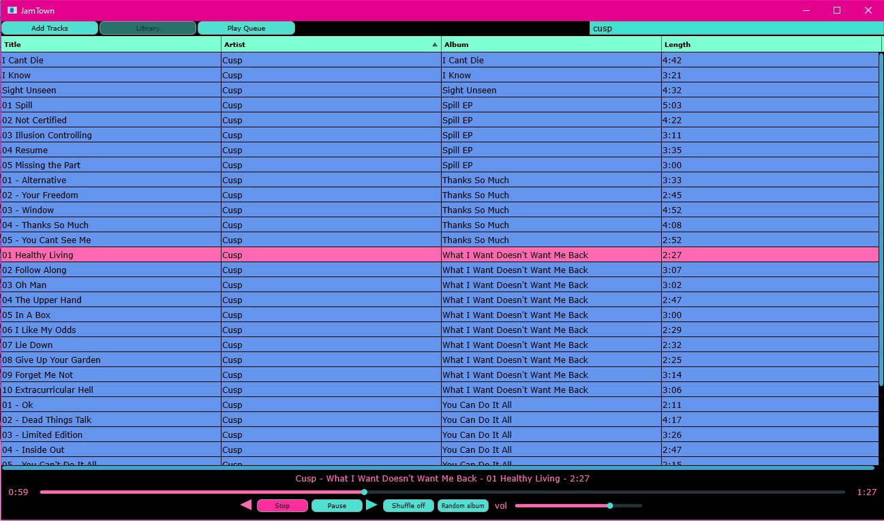

# Jamtown

A cross-platform audio player and library manager built with JUCE.

## Platforms

Tested on Windows 10 and Ubuntu.

## Build Requirements

* C++ 23 compatible compiler
* CMake 3.20+
* JUCE ([JUCE with CMake setup instructions](https://github.com/juce-framework/JUCE/blob/master/docs/CMake%20API.md))

## Building from Source

1. `>git clone https://github.com/matt-manes/jamtown`
2. `>cd jamtown`
3. `jamtown>cmake -B build`
4. `jamtown>cmake --build build --config Release`

The executable will be somewhere in the `build` folder (the exact path varies across platforms).  
